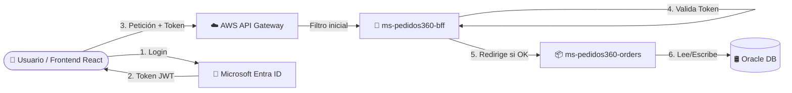
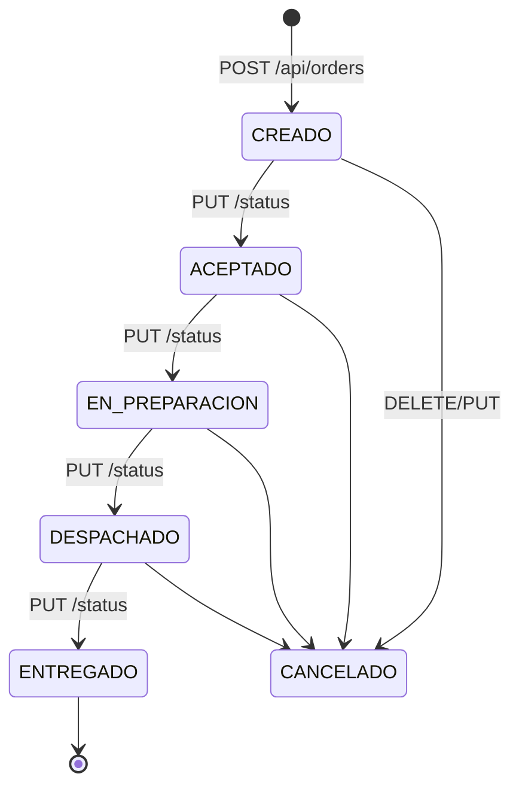

# Pedidos360 - Cloud Backend ☁️🛒

Bienvenido al repositorio del **Backend de Pedidos360**, una plataforma diseñada para una red de 20 PyMEs (panaderías y cafés). El objetivo de este sistema es permitirles recibir pedidos por la web, coordinar la cocina y los despachos, y mantener un seguimiento en tiempo real del estado de cada pedido.

Este proyecto fue desarrollado para la Evaluación Final Transversal de **Desarrollo Cloud Native I (DSY1107)**. Está construido con **Spring Boot 3.5** y **Java 21**, basado en una arquitectura de microservicios contenerizados con Docker.

---

## 🎯 ¿Qué es lo que hace?

Pedidos360 se encarga de orquestar todo el proceso de venta online de las PyMEs. Actualmente, el backend gestiona las siguientes funcionalidades principales:

- **Autenticación y Autorización:** Validación de identidades a través de Microsoft Entra ID.
- **Gestión de Pedidos:** Creación, lectura, actualización y eliminación de pedidos.
- **Control de Estados:** Validación estricta del ciclo de vida de un pedido (ej. no se puede despachar algo que no ha sido aceptado).
- **Métricas Operativas:** Registro de fechas de cambio de estado para calcular el *lead time* (tiempo desde que se crea hasta que se entrega).

> [!NOTE] 
> **Próximamente:** Se agregarán funcionalidades para el catálogo de productos, notificaciones en tiempo real con **RabbitMQ**, y auditoría/reportería asíncrona mediante **Kafka**.

---

## 🏗️ Arquitectura y Componentes (Qué hay en este repo)

El repositorio está dividido en los siguientes componentes principales:

1. **`ms-pedidos360-bff` (Backend For Frontend)**: Es la puerta de entrada principal (API Gateway interno). Recibe las llamadas desde el frontend, valida el token JWT contra Microsoft Entra ID y, si es válido y tiene los permisos adecuados, redirige la petición al microservicio correspondiente.
2. **`ms-pedidos360-orders` (Microservicio de Pedidos)**: El corazón del sistema. Contiene toda la lógica de negocio sobre los pedidos. Se conecta a una base de datos **Oracle** para persistir la información.
3. **`infra/apps/compose.yml`**: Orquestación de contenedores Docker. Permite levantar todo el entorno (Oracle, BFF y Orders) con un solo comando.
4. **`docs/GUIA-AWS.md`**: Documentación paso a paso para desplegar la solución en la nube utilizando AWS (EC2 + API Gateway).

*(El frontend en React se encuentra en su propio repositorio: **`pedidos360-frontend`**).*

---

## ⚙️ ¿Cómo funciona?

El flujo de comunicación está diseñado para ser seguro y eficiente. La base de datos y los microservicios internos nunca quedan expuestos directamente a Internet; todo pasa a través del BFF.



### Paso a paso:
1. El usuario inicia sesión en el frontend usando su cuenta de Microsoft.
2. El frontend recibe un token de acceso (JWT).
3. Todas las llamadas al backend incluyen este token en el header `Authorization`.
4. En producción (AWS), el API Gateway actúa como primer escudo. En desarrollo local, el frontend se comunica directamente con el BFF (`http://localhost:8080`).
5. El **BFF valida el token**: verifica firma, emisor, audiencia, vigencia y que contenga el permiso `access_as_user`.
6. Si el token es válido, el BFF enruta la petición al microservicio **Orders** (`http://localhost:8081`).
7. **Orders** procesa la regla de negocio y persiste los cambios en la base de datos.

---

## 🔒 Seguridad y Control de Acceso

El sistema no utiliza roles complejos (Role-Based Access Control), sino que se basa en la validez del token y en permisos específicos delegados.

| Situación del Token | Respuesta del BFF |
| :--- | :--- |
| Sin token, inválido, vencido, otro emisor o audiencia incorrecta | **401 Unauthorized** |
| Token válido pero SIN el permiso `access_as_user` | **403 Forbidden** |
| Petición a ruta que no existe | **403 Forbidden** |
| Token completamente válido | **Pasa al microservicio (2xx)** |

### Configuración en Azure (Entra ID)
Para que el entorno funcione, el registro de la API en el tenant de Entra ID (`vicho1.onmicrosoft.com`) debe tener:
- `requestedAccessTokenVersion` establecido en `2` en el Manifest (de lo contrario el emisor será incorrecto).
- El permiso `access_as_user` expuesto.

El BFF validará contra:
- **Emisor (issuer):** `https://login.microsoftonline.com/<ENTRA_TENANT_ID>/v2.0`
- **Audiencia:** El Client ID del registro de la API.
- **Scope:** `api://<API_CLIENT_ID>/access_as_user`

---

## 🔄 El Ciclo de Vida de un Pedido

El microservicio de pedidos impone un control estricto sobre las transiciones de estado.



> [!WARNING]
> **Regla de Negocio Crítica:** No se puede despachar un pedido que no haya sido aceptado. Si se intenta una transición inválida, el sistema responderá con un código **409 Conflict** e indicará cuáles son los estados permitidos desde el estado actual.

---

## 🚀 Cómo levantar el proyecto localmente

### Opción A: Con Docker (Recomendado) 🐳

Solo necesitas tener Docker Desktop instalado. Ejecuta desde la raíz del repositorio:

```bash
docker compose -f infra/apps/compose.yml up -d --build
```

**Nota:** La primera vez puede tardar unos minutos porque descargará la imagen de Oracle y compilará los microservicios. `Orders` esperará automáticamente a que la base de datos Oracle esté lista antes de arrancar.

El archivo `compose.yml` ya incluye variables de entorno para desarrollo. Si necesitas cambiar credenciales, copia `infra/apps/.env.example` a `infra/apps/.env` y ajusta los valores.

### Opción B: Sin Docker (Para desarrollo rápido) 💻

Si quieres iterar rápido sobre el código, puedes ejecutar el microservicio de Orders de forma aislada usando una base de datos en memoria (**H2**).

```bash
cd ms-pedidos360-orders
sh mvnw spring-boot:run
# En Windows usa: mvnw.cmd spring-boot:run
```

El servicio levantará en `http://localhost:8081`. Puedes acceder a **Swagger UI** para probar la API en: `http://localhost:8081/swagger-ui.html`.

---

## 🧪 Endpoints y Pruebas

### Endpoints de Pedidos (`Orders`)

| Método | Ruta | Descripción |
| :--- | :--- | :--- |
| `POST` | `/api/orders` | Crea un nuevo pedido (Inicia en estado `CREADO`) |
| `GET` | `/api/orders/{id}` | Obtiene los detalles de un pedido específico |
| `GET` | `/api/orders` | Lista pedidos. Soporta filtros: `?status=...&from=...&to=...` |
| `PUT` | `/api/orders/{id}` | Edita un pedido (solo si aún no ha sido aceptado) |
| `PUT` | `/api/orders/{id}/status`| Cambia el estado del pedido (ej. `{ "status": "ACEPTADO" }`) |
| `DELETE`| `/api/orders/{id}` | Cancela un pedido |

*(Las fechas para los filtros deben ir en formato ISO, ej. `2026-09-10T00:00:00`)*

### Endpoint de Prueba (`BFF`)

Puedes probar la autenticación de Entra ID atacando directamente al BFF:

```bash
# Probar sin token (Retorna 401)
curl -i http://localhost:8080/api/orders

# Prueba de punta a punta con token real
read -rsp "Pegue el access token: " tokenPrueba; echo
curl -i -H "Authorization: Bearer $tokenPrueba" http://localhost:8080/api/data
```
*(Debería responder **200 OK** con `{ "mensaje": "Acceso autorizado a Spring Boot", ... }`)*

### Pruebas Unitarias y de Integración

Cada microservicio cuenta con su propia batería de tests automatizados (usando JUnit y Mockito). Puedes correrlos con Maven:

```bash
cd ms-pedidos360-orders && sh mvnw test
cd ms-pedidos360-bff && sh mvnw test
```
*(Recuerda usar `mvnw.cmd test` en Windows)*. No necesitas instalar Maven previamente, el Wrapper (`mvnw`) lo descargará por ti.
