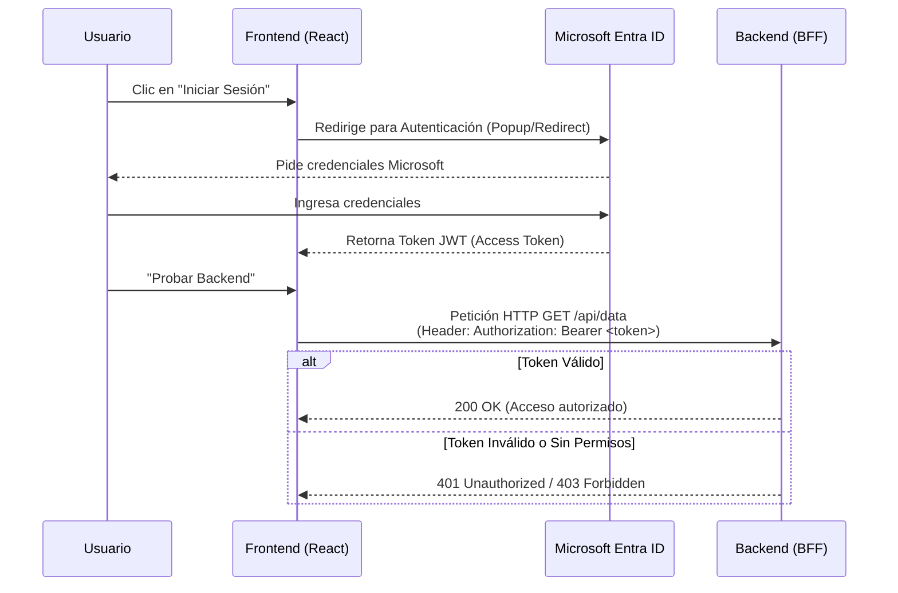

# Pedidos360 - Frontend 🌐🛒

Este repositorio contiene la aplicación Frontend para **Pedidos360**, diseñada para que una red de 20 PyMEs pueda interactuar con el sistema de pedidos de forma fácil y segura.

Actualmente, este proyecto se enfoca en establecer y probar la base de **Autenticación con Microsoft Entra ID** y la comunicación segura con el Backend (a través del **BFF** o API Gateway).

Está desarrollado con **React 19** y empaquetado con **Vite**.

---

## 🛠️ Tecnologías Utilizadas

- **React (v19):** Construcción de la interfaz de usuario.
- **Vite:** Herramienta de construcción y servidor de desarrollo ultrarrápido.
- **Microsoft Authentication Library (MSAL):** 
  - `@azure/msal-react` y `@azure/msal-browser` para manejar el flujo de inicio de sesión con Azure Entra ID.

---

## 🔐 ¿Cómo funciona la Autenticación?

El frontend no almacena contraseñas ni valida usuarios por sí mismo. Todo el proceso se delega a **Microsoft Entra ID**. Una vez que el usuario inicia sesión exitosamente, el frontend recibe un **Token JWT** que adjunta a todas las peticiones (en el header `Authorization`) dirigidas al backend.



---

## 🚀 Cómo levantar el proyecto localmente

### 1. Prerrequisitos
Asegúrate de tener instalado **Node.js** (recomendado v18 o superior).

### 2. Instalación de dependencias
Abre una terminal en la raíz del proyecto y ejecuta:
```bash
npm install
```

### 3. Configuración de Variables de Entorno
El proyecto utiliza variables de entorno para conectarse al tenant correcto de Azure y al BFF. 
Copia el archivo de ejemplo para crear tu configuración local:

```bash
cp .env.example .env.local
```
Si es necesario, edita `.env.local` para ajustar las URLs (por defecto apunta al BFF en `http://localhost:8085`, pero si tu Docker compose expone el BFF en el `8080`, deberás cambiarlo a `http://localhost:8080`).

### 4. Ejecución del Servidor de Desarrollo
```bash
npm run dev
```
La aplicación estará disponible en **`http://localhost:5173`**. 

> [!WARNING]
> El puerto **5173** es estricto (`strictPort: true` en Vite). Debe ser ese puerto específico porque está configurado en las *Redirect URIs* del registro de la aplicación en Azure Entra ID y en las reglas de CORS del Backend.

---

## 🧪 ¿Qué puedo probar actualmente?

Al abrir la aplicación verás una interfaz de prueba de sesión:

1. **Iniciar Sesión:** Permite hacer login usando tu cuenta de Microsoft.
2. **Revisión del Token:** Muestra información decodificada del JWT (como tu nombre, email, roles y el scope `access_as_user`).
3. **Prueba contra el Backend:** Un botón que realiza una petición al BFF para comprobar que el token es aceptado correctamente por el servidor Spring Boot.

---

## 📂 Estructura Principal del Proyecto

- `src/auth/`: Contiene la configuración de MSAL (`authConfig.js`), los hooks de sesión y los componentes visuales de Login.
- `src/api/http.js`: Cliente HTTP (basado en `fetch`) configurado para inyectar automáticamente el Token de MSAL en cada petición.
- `src/components/`: Componentes de interfaz de usuario, como los paneles para visualizar el token y los botones de prueba.
- `vite.config.js`: Configuración de Vite, forzando el puerto `5173` y configurando un punto de entrada adicional (`redirect.html`) necesario para algunos flujos de MSAL.
